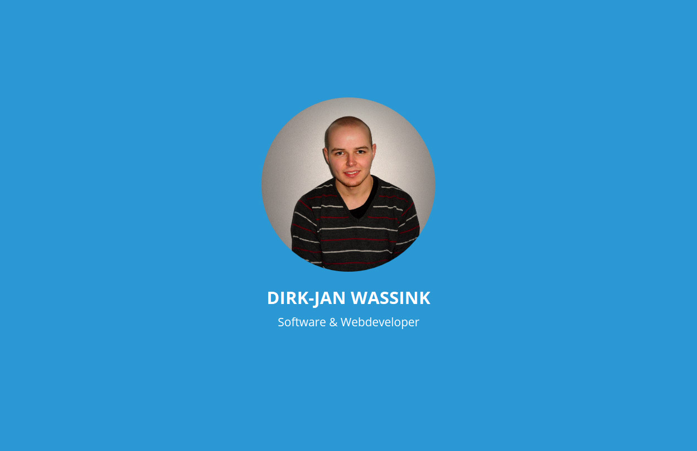
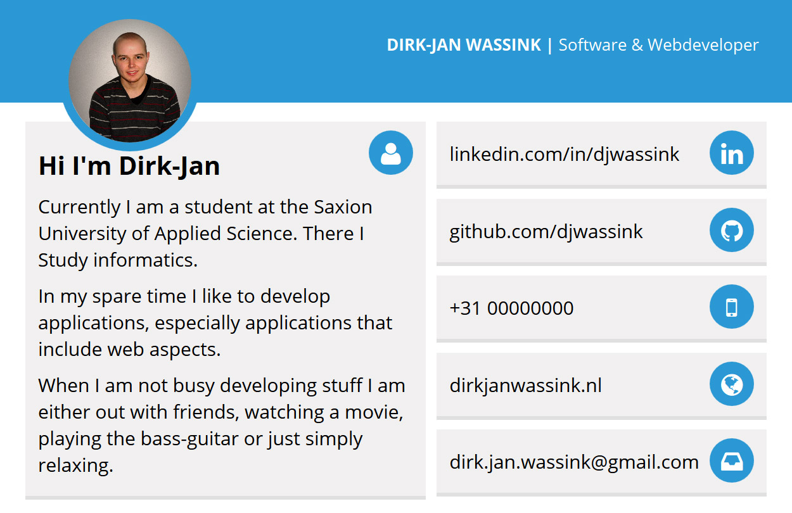

# Material-business-card
My ow business card made in html/css/js with a material feel.

## Screenshots

## Credits
Inspired after the .psd of [Md Alamin Mir](http://www.materialup.com/posts/free-resume-with-businesscard)

## How to
You can simply alter the html file to change the personal details. Be sure to use a perfectly square image to get a exact round image.

Also you need the external librarys do do a `bower install` first.

Now you can open the index.html file. Here it will open on the front side. You can change it in the settings dropdown. Here you can also change the scale of the card. You can also export it to a canvas but this is high experimental and doesn't seem to work. I recommend [ScreenGrab](https://addons.mozilla.org/nl/firefox/addon/screengrab-fix-version/) to make a png out of the card.
